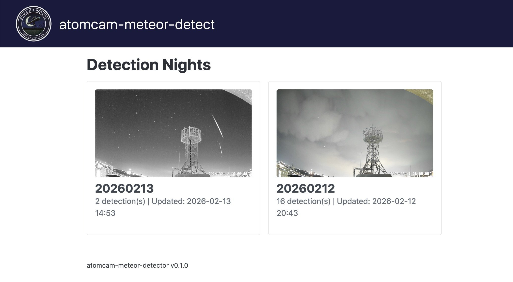
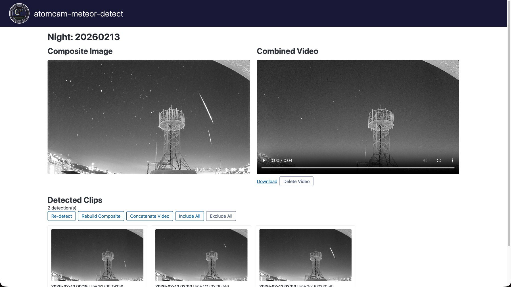

# atomcam-meteor-detector

ATOM Cam の動画から流星を自動検出し、比較明合成画像と結合動画を生成するツール。

## Features

- ATOM Cam の SD カード録画から1分クリップを自動ダウンロード
- フレーム差分 + Hough 変換による流星自動検出
- 比較明合成 (lighten composite) 画像の自動生成
- 検出クリップの結合動画を ffmpeg で生成
- Web ダッシュボードで検出結果の確認・除外・再合成
- cron による定期実行 + systemd による Web サーバー常駐

## Requirements

- Python 3.10+
- ffmpeg (動画結合用)
- ATOM Cam (HTTP アクセス可能な状態)

## Installation

```bash
# uv を使用
uv sync

# pip を使用
pip install -e .

# 開発用
uv sync --group dev
```

## Configuration

設定ファイルをコピーして編集:

```bash
cp config/settings.example.yaml config/settings.yaml
```

詳細は `config/settings.example.yaml` 内のコメントを参照してください。

## Usage

### CLI

```bash
# パイプライン実行
atomcam run -c config/settings.yaml -v

# 特定日付を指定
atomcam run -c config/settings.yaml --date 20250101

# ドライラン (実際のDL/処理なし)
atomcam run -c config/settings.yaml --dry-run -vv

# 検出ステータス確認
atomcam status -c config/settings.yaml
atomcam status -c config/settings.yaml --date 20250101 --json

# 設定検証
atomcam config -c config/settings.yaml --validate
```

### Web ダッシュボード

```bash
atomcam serve -c config/settings.yaml
```

ブラウザで `http://localhost:8080` にアクセス。

- **ナイト一覧**: 日付ごとの検出数と合成画像サムネイル
- **ナイト詳細**: 合成画像、結合動画、検出クリップのグリッド表示
- **除外/復帰**: 検出線単位で included/excluded を切り替え
- **再合成**: excluded を除外して合成画像・結合動画を再作成

| ナイト一覧 | ナイト詳細 |
|:---:|:---:|
|  |  |

## 参考

流星検出アルゴリズム（フレーム差分 → Canny エッジ検出 → HoughLinesP 直線検出）およびその検出パラメータは、kin-hasegawa さんの [meteor-detect](https://github.com/kin-hasegawa/meteor-detect) を強く参考にしています。

詳細な比較は [docs/reference-comparison-kin-hasegawa.md](docs/reference-comparison-kin-hasegawa.md) を参照してください。

## ドキュメント

| ドキュメント | 内容 |
|------------|------|
| [docs/specs.md](docs/specs.md) | アーキテクチャ、DB スキーマ、API 仕様 |
| [docs/raspberry-pi-setup.md](docs/raspberry-pi-setup.md) | Raspberry Pi セットアップ・デプロイ |
| [docs/testing.md](docs/testing.md) | テスト規約 |
| [docs/reference-comparison-kin-hasegawa.md](docs/reference-comparison-kin-hasegawa.md) | kin-hasegawa/meteor-detect との比較 |

## Development

```bash
# テスト実行
uv run pytest

# カバレッジ付き
uv run pytest --cov=atomcam_meteor --cov-report=html

# コード品質
uv run ruff check atomcam_meteor/
uv run mypy atomcam_meteor/
```

## License

MIT
