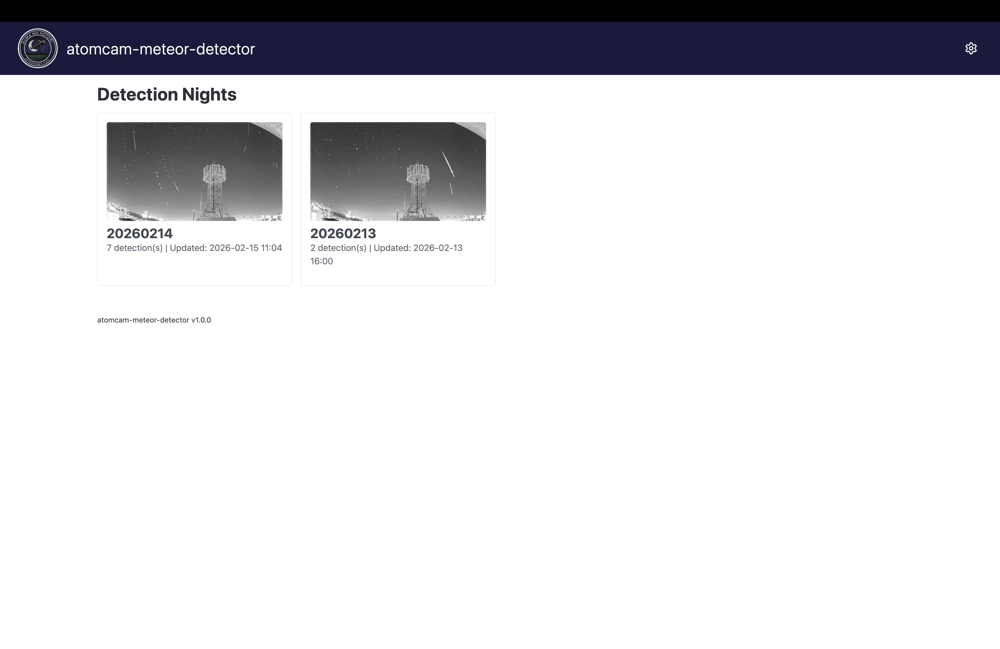
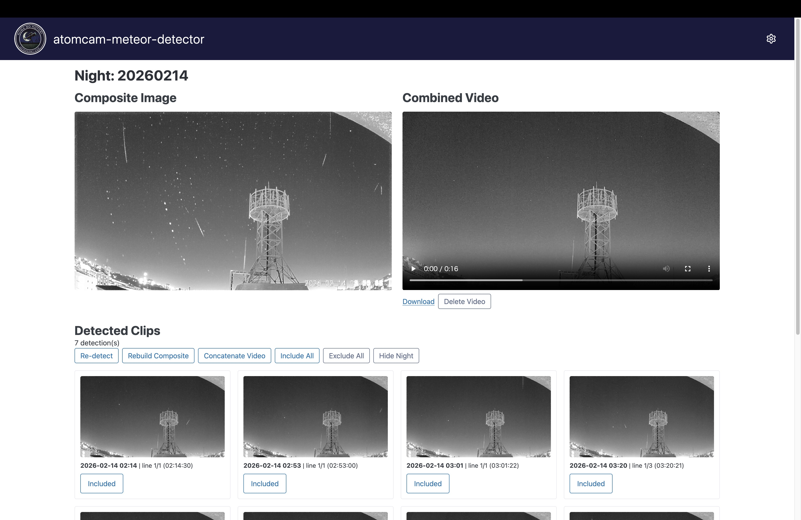
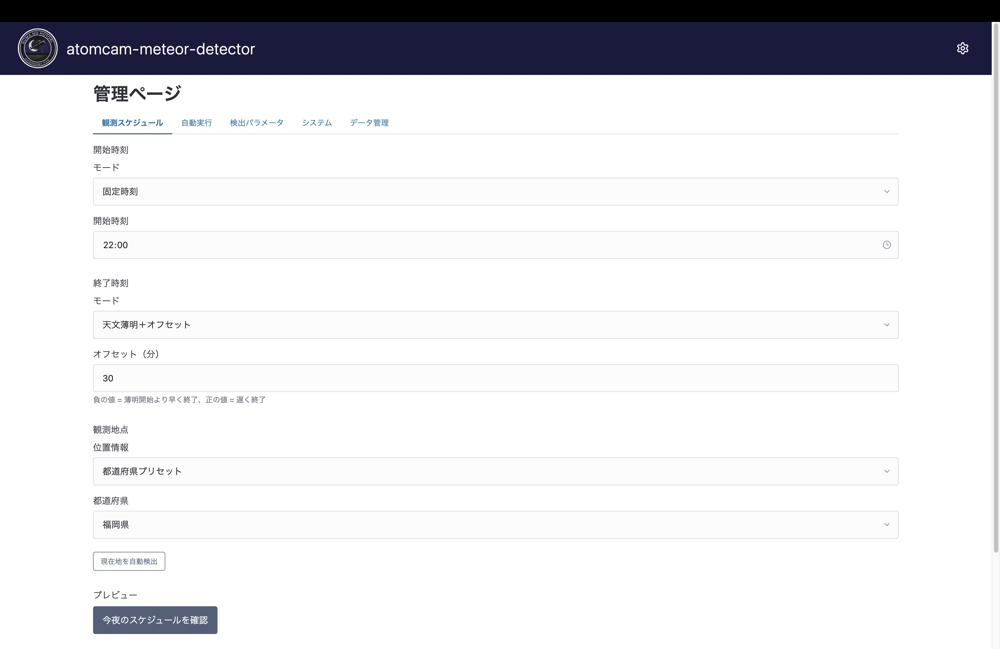
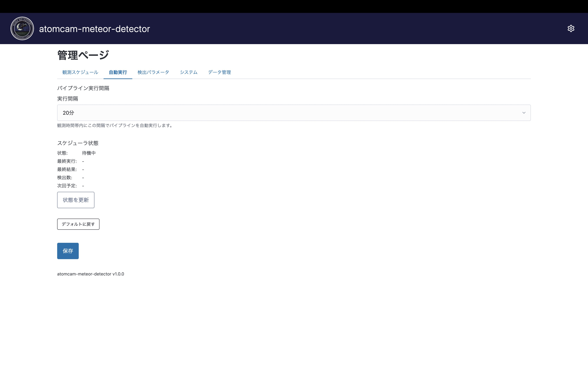
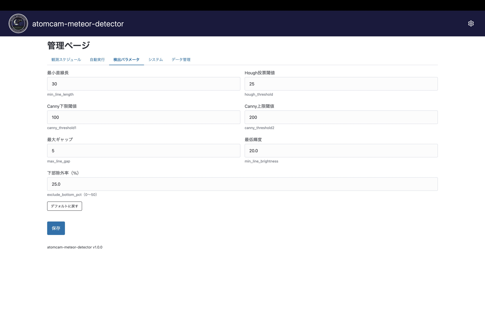
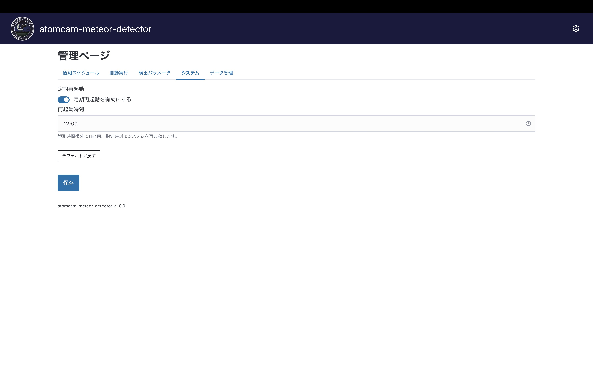

# atomcam-meteor-detector

ATOM Cam の動画から流星を自動検出し、比較明合成画像と結合動画を生成するツール。
Raspberry Piで運用すれば毎晩1時間毎など定期的に検出し、朝になったら一晩分の比較明合成された画像を取得することが可能です。

## Getting Started

セットアップ手順は [docs/setup.md](docs/setup.md) を参照してください。

- [PC 環境でのセットアップ](docs/setup.md#pc-環境でのセットアップ)
- [Raspberry Pi 環境でのセットアップ](docs/setup.md#raspberry-pi-環境でのセットアップ)

## Features

- ATOM Cam の SD カード録画から1分クリップを自動ダウンロード
- フレーム差分 + Hough 変換による流星自動検出
- 比較明合成 (lighten composite) 画像の自動生成
- 検出クリップの結合動画を ffmpeg で生成
- Web ダッシュボードで検出結果の確認・除外・再合成
- 内蔵スケジューラによる自動定期実行 + systemd による Web サーバー常駐
- Web 管理ページで観測スケジュール・検出パラメータ・システム設定を変更可能
- 天文薄明ベースの観測時間帯自動計算（47都道府県プリセット対応）
- 夜ごとの非表示機能、Re-detect（再検出）機能

### Web ダッシュボード

#### ナイト一覧

日付ごとの検出数と比較明合成画像をグリッド表示。各カードをクリックしてナイト詳細へ遷移。

#### ナイト詳細

- 比較明合成画像・結合動画の表示
- 検出クリップのグリッド表示（検出線単位で除外/含有を切り替え）
- **Re-detect**: ダウンロード済みクリップから検出をやり直し
- **Rebuild**: excluded を反映して合成画像・結合動画を再作成
- **Hide Night**: 夜間データをトップページから非表示

#### 管理ページ (`/admin`)

| 観測スケジュール | 自動実行 |
|:---:|:---:|
|  |  |
| 開始/終了時刻のモード選択（固定 / 天文薄明 / 薄明オフセット）、観測地点の設定（47都道府県プリセット / カスタム座標） | パイプライン実行間隔の設定、スケジューラの状態確認 |

| 検出パラメータ | システム |
|:---:|:---:|
|  |  |
| min_line_length, canny_threshold, hough_threshold 等の検出パラメータ調整 | 定期再起動の設定 |

| データ管理 |
|:---:|
|  |
| 非表示にした夜間データの一覧表示・再表示 |

## 参考

流星検出アルゴリズム（フレーム差分 → Canny エッジ検出 → HoughLinesP 直線検出）およびその検出パラメータは、kin-hasegawa さんの [meteor-detect](https://github.com/kin-hasegawa/meteor-detect) を強く参考にしています。

詳細な比較は [docs/reference-comparison-kin-hasegawa.md](docs/reference-comparison-kin-hasegawa.md) を参照してください。

## ドキュメント

| ドキュメント | 内容 |
|------------|------|
| [docs/setup.md](docs/setup.md) | セットアップ・使い方（PC / Raspberry Pi） |
| [docs/specs.md](docs/specs.md) | アーキテクチャ、DB スキーマ、API 仕様 |
| [docs/testing.md](docs/testing.md) | テスト規約 |
| [docs/reference-comparison-kin-hasegawa.md](docs/reference-comparison-kin-hasegawa.md) | kin-hasegawa/meteor-detect との比較 |

## License

MIT
