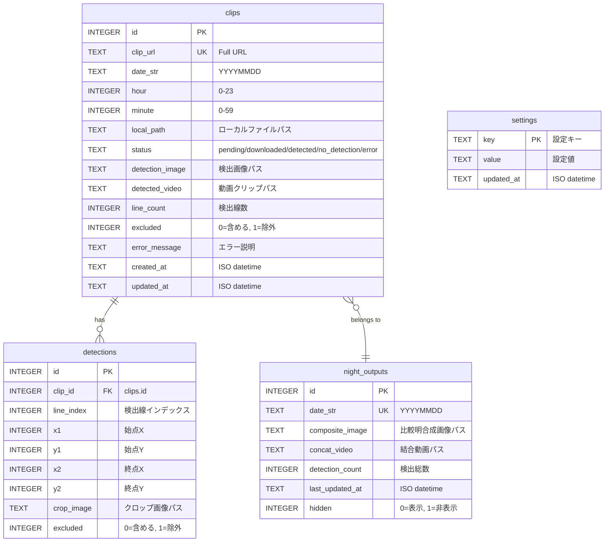

# Technical Specifications

## Architecture

```
CLI (手動実行)                systemd (常駐)
└─ atomcam run               └─ atomcam serve
     ├─ FileLock                   ├─ FastAPI + Uvicorn
     ├─ AppConfig                  ├─ Jinja2 Templates
     ├─ StateDB ◄──── SQLite ────► StateDB
     │                (WAL)        │
     ├─ Downloader                 ├─ PipelineScheduler (asyncio)
     ├─ Detector                   ├─ GET  /
     ├─ Compositor ◄────────────── GET  /nights/{d}
     ├─ Concatenator               ├─ GET  /admin
     └─ HookRunner                 ├─ POST /rebuild, /redetect, ...
                                   └─ Static files
```

## Pipeline Flow

1. **日付決定**: 正午前 → 今日 (昨夜の観測)、正午後 → 明日 (今夜の観測)
2. **時間帯構築**: `start_time` から `end_time` までの時間スロットを生成（分レベルでフィルタリング）
3. **ダウンロード**: 各時間帯のクリップを HTTP で取得 (リトライ付き)
4. **検出**: フレーム差分 → Canny エッジ → HoughLinesP
5. **合成**: 検出画像を比較明合成 (pixel-wise maximum)
6. **結合**: 検出クリップを ffmpeg で結合
7. **DB更新**: clips / night_outputs テーブルを更新
8. **フック発火**: DetectionEvent / NightCompleteEvent

## Detection Algorithm

1. 動画をフレームグループに分割 (fps * exposure_duration_sec)
2. グループ内でフレーム間差分を計算
3. 差分を pixel-wise maximum で合成
4. マスク適用 (設定時)
5. Gaussian Blur → Canny Edge Detection
6. HoughLinesP で直線検出 (min_line_length 以上)

## Database Schema

### ER 図



### clips テーブル

| Column | Type | Description |
|--------|------|-------------|
| id | INTEGER PK | Auto-increment |
| clip_url | TEXT UNIQUE | Full URL |
| date_str | TEXT | YYYYMMDD |
| hour | INTEGER | 0-23 |
| minute | INTEGER | 0-59 |
| local_path | TEXT | Local file path |
| status | TEXT | pending/downloaded/detected/no_detection/error |
| detection_image | TEXT | Detection image path |
| detected_video | TEXT | Video clip path |
| line_count | INTEGER | Detected line count |
| excluded | INTEGER | 0=included, 1=excluded |
| error_message | TEXT | Error description |
| created_at | TEXT | ISO datetime |
| updated_at | TEXT | ISO datetime |

### night_outputs テーブル

| Column | Type | Description |
|--------|------|-------------|
| id | INTEGER PK | Auto-increment |
| date_str | TEXT UNIQUE | YYYYMMDD |
| composite_image | TEXT | Composite image path |
| concat_video | TEXT | Concatenated video path |
| detection_count | INTEGER | Total detections |
| last_updated_at | TEXT | ISO datetime |
| hidden | INTEGER | 0=表示, 1=非表示 (DEFAULT 0) |

### detections テーブル

| Column | Type | Description |
|--------|------|-------------|
| id | INTEGER PK | Auto-increment |
| clip_id | INTEGER FK | clips.id への外部キー |
| line_index | INTEGER | クリップ内の検出線インデックス |
| x1 | INTEGER | 始点 X 座標 |
| y1 | INTEGER | 始点 Y 座標 |
| x2 | INTEGER | 終点 X 座標 |
| y2 | INTEGER | 終点 Y 座標 |
| crop_image | TEXT | クロップ画像パス |
| excluded | INTEGER | 0=含める, 1=除外 |

- UNIQUE 制約: `(clip_id, line_index)`

### settings テーブル

| Column | Type | Description |
|--------|------|-------------|
| key | TEXT PK | 設定キー |
| value | TEXT | 設定値 |
| updated_at | TEXT | ISO datetime |

## Web ダッシュボード

FastAPI + Jinja2 によるサーバーサイドレンダリング。フロントエンドは Pico CSS + インラインスクリプトで構成。

### 画面構成

| 画面 | パス | 内容 |
|------|------|------|
| ナイト一覧 | `/` | 日付ごとの検出数・合成画像サムネイルをグリッド表示。非表示の夜は除外 |
| ナイト詳細 | `/nights/{date_str}` | 合成画像・結合動画・検出クリップの一覧と操作（Re-detect, Rebuild, Hide Night 等） |
| 管理ページ | `/admin` | 観測スケジュール・自動実行・検出パラメータ・システム・データ管理の5タブ構成 |

### 主要機能

**検出結果の管理:**
- 検出線単位での除外/含有トグル
- 夜間全体の一括除外/含有
- 合成画像リビルド（excluded を反映して再合成）
- 結合動画の生成・削除
- 再検出（ダウンロード済みクリップから検出をやり直し）
- 夜間データの非表示/再表示

**設定変更（管理ページ）:**
- スケジュール設定（開始/終了時刻のモード: 固定 / 天文薄明 / 薄明オフセット）
- 観測地点設定（プリセット都道府県 / カスタム座標）
- パイプライン実行間隔の設定
- 検出パラメータ調整（7パラメータ: min_line_length, canny_threshold1/2, hough_threshold, max_line_gap, min_line_brightness, exclude_bottom_pct）
- システム設定（定期再起動）
- スケジュールプレビュー（今夜の開始/終了時刻を確認）
- 各設定のリセット（YAML のデフォルト値に戻す）

### バックグラウンドタスク

再検出・リビルド・動画結合は FastAPI の `BackgroundTasks` で非同期実行。UI は 2 秒間隔のポーリングで進捗を表示し、完了時にページをリロードする。

| タスク | 開始 | 進捗確認 | キャンセル |
|--------|------|---------|-----------|
| 再検出 | `POST /api/nights/{d}/redetect` | `GET .../redetect/status` | `POST .../redetect/cancel` |
| リビルド | `POST /api/nights/{d}/rebuild` | `GET .../rebuild/status` | — |
| 動画結合 | `POST /api/nights/{d}/concatenate` | `GET .../concatenate/status` | — |

### 設定の優先順位

```
YAML 設定 (config/settings.yaml)
  ↓ DB に値があれば上書き
DB 設定 (settings テーブル)
  ↓ 最終値
resolve_schedule() / resolve_detection_config()
```

### マウント構成

| パス | 内容 |
|------|------|
| `/` | ルーター（HTML ページ + JSON API） |
| `/static` | 静的アセット（logo.png 等） |
| `/media/downloads` | ダウンロード済みクリップ |
| `/media/output` | 出力ファイル（合成画像・結合動画・検出画像） |

## API Endpoints

### HTML ページ

| Method | Path | Description |
|--------|------|-------------|
| GET | `/` | ナイト一覧ページ |
| GET | `/nights/{date_str}` | ナイト詳細ページ |
| GET | `/admin` | 管理ページ |

### 夜間データ取得

| Method | Path | Description |
|--------|------|-------------|
| GET | `/api/nights` | 全夜間リスト |
| GET | `/api/nights/{date_str}` | 夜間詳細（output + clips） |
| GET | `/api/nights/{date_str}/clips` | クリップリスト |
| PATCH | `/api/nights/{date_str}/visibility` | 夜間データの表示/非表示切り替え |

### クリップ・検出管理

| Method | Path | Description |
|--------|------|-------------|
| PATCH | `/api/clips/{clip_id}` | クリップの除外フラグ切り替え |
| PATCH | `/api/detections/{detection_id}` | 検出線の除外フラグ切り替え |
| PATCH | `/api/nights/{date_str}/detections/bulk` | 夜間全検出の一括除外設定 |
| DELETE | `/api/nights/{date_str}/video` | 結合動画の削除 |

### バックグラウンドタスク

| Method | Path | Description |
|--------|------|-------------|
| POST | `/api/nights/{date_str}/redetect` | 再検出開始 |
| GET | `/api/nights/{date_str}/redetect/status` | 再検出進捗 |
| POST | `/api/nights/{date_str}/redetect/cancel` | 再検出キャンセル |
| POST | `/api/nights/{date_str}/rebuild` | 合成画像リビルド開始 |
| GET | `/api/nights/{date_str}/rebuild/status` | リビルド進捗 |
| POST | `/api/nights/{date_str}/concatenate` | 動画結合開始 |
| GET | `/api/nights/{date_str}/concatenate/status` | 結合進捗 |

### 設定管理

| Method | Path | Description |
|--------|------|-------------|
| GET | `/api/settings/schedule` | スケジュール設定取得 |
| PUT | `/api/settings/schedule` | スケジュール設定保存 |
| DELETE | `/api/settings/schedule` | スケジュール設定リセット |
| GET | `/api/settings/schedule/preview` | スケジュールプレビュー |
| GET | `/api/settings/detection` | 検出パラメータ取得 |
| PUT | `/api/settings/detection` | 検出パラメータ保存 |
| DELETE | `/api/settings/detection` | 検出パラメータリセット |
| GET | `/api/settings/system` | システム設定取得 |
| PUT | `/api/settings/system` | システム設定保存 |
| DELETE | `/api/settings/system` | システム設定リセット |
| GET | `/api/settings/prefectures` | 都道府県リスト |
| GET | `/api/scheduler/status` | スケジューラ状態取得 |

### 静的ファイル

| Method | Path | Description |
|--------|------|-------------|
| GET | `/static/...` | 静的アセット |
| GET | `/media/downloads/...` | ダウンロード済みクリップ |
| GET | `/media/output/...` | 出力画像・動画 |

## パイプラインスケジューラ

`PipelineScheduler` が Web サーバーの lifespan 内で起動し、観測時間帯中にパイプラインを定期実行する。

### 主要機能

- **asyncio ベース**: 外部ライブラリ不要、`asyncio.to_thread` でパイプライン実行
- **設定の動的解決**: 毎サイクルで DB から `interval_minutes` と観測スケジュールを再取得（管理ページの変更を即時反映）
- **排他制御**: `FileLock` で CLI (`atomcam run`) との同時実行を防止
- **定期再起動**: 観測時間帯外に1日1回、設定された時刻にシステムを再起動（`sudo reboot`、要 sudoers 設定）
- `interval_minutes == 0` でスケジューラ無効（手動実行のみ）

### ステータス API

`GET /api/scheduler/status` で以下の情報を取得:

- スケジューラの有効/無効状態
- 次回実行予定時刻
- 最終実行時刻
- 現在の設定値（interval_minutes 等）

## Exception Hierarchy

```
AtomcamError
├── ConfigError
├── CameraError
│   └── DownloadError (url)
├── DetectionError (clip_path)
├── CompositorError
├── ConcatenationError
├── LockError
└── HookError
```

## Hook System

- `Hook` Protocol: `on_detection`, `on_night_complete`, `on_error`
- `HookRunner`: Iterates hooks, isolates failures per hook
- `LoggingHook`: Default implementation, logs all events

## Resource Constraints

- フレームは exposure_duration_sec 分のグループ単位で処理 (メモリ制限)
- ダウンロードはストリーミング (8KB チャンク)
- SQLite WAL モードで読み書き同時アクセス対応
- FileLock で CLI / スケジューラの多重実行を防止
