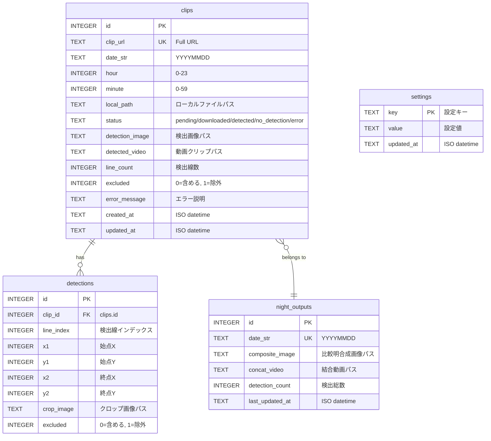

# Technical Specifications

## Architecture

```
cron (毎朝6:00)               systemd (常駐)
└─ atomcam run                └─ atomcam serve
     ├─ FileLock                   ├─ FastAPI + Uvicorn
     ├─ AppConfig                  ├─ Jinja2 Templates
     ├─ StateDB ◄──── SQLite ────► StateDB
     │                (WAL)        │
     ├─ Downloader                 ├─ GET  /
     ├─ Detector                   ├─ GET  /nights/{d}
     ├─ Compositor ◄────────────── POST /rebuild
     ├─ Concatenator               └─ Static files
     └─ HookRunner
```

## Pipeline Flow

1. **日付決定**: 正午前 → 今日 (昨夜の観測)、正午後 → 明日 (今夜の観測)
2. **時間帯構築**: `start_time` から `end_time` までの時間スロットを生成（分レベルでフィルタリング）
3. **ダウンロード**: 各時間帯のクリップを HTTP で取得 (リトライ付き)
4. **検出**: フレーム差分 → Canny エッジ → HoughLinesP
5. **合成**: 検出画像を比較明合成 (pixel-wise maximum)
6. **結合**: 検出クリップを ffmpeg で結合
7. **DB更新**: clips / night_outputs テーブルを更新
8. **フック発火**: DetectionEvent / NightCompleteEvent

## Detection Algorithm

1. 動画をフレームグループに分割 (fps * exposure_duration_sec)
2. グループ内でフレーム間差分を計算
3. 差分を pixel-wise maximum で合成
4. マスク適用 (設定時)
5. Gaussian Blur → Canny Edge Detection
6. HoughLinesP で直線検出 (min_line_length 以上)

## Database Schema

### ER 図



### clips テーブル

| Column | Type | Description |
|--------|------|-------------|
| id | INTEGER PK | Auto-increment |
| clip_url | TEXT UNIQUE | Full URL |
| date_str | TEXT | YYYYMMDD |
| hour | INTEGER | 0-23 |
| minute | INTEGER | 0-59 |
| local_path | TEXT | Local file path |
| status | TEXT | pending/downloaded/detected/no_detection/error |
| detection_image | TEXT | Detection image path |
| detected_video | TEXT | Video clip path |
| line_count | INTEGER | Detected line count |
| excluded | INTEGER | 0=included, 1=excluded |
| error_message | TEXT | Error description |
| created_at | TEXT | ISO datetime |
| updated_at | TEXT | ISO datetime |

### night_outputs テーブル

| Column | Type | Description |
|--------|------|-------------|
| id | INTEGER PK | Auto-increment |
| date_str | TEXT UNIQUE | YYYYMMDD |
| composite_image | TEXT | Composite image path |
| concat_video | TEXT | Concatenated video path |
| detection_count | INTEGER | Total detections |
| last_updated_at | TEXT | ISO datetime |

### detections テーブル

| Column | Type | Description |
|--------|------|-------------|
| id | INTEGER PK | Auto-increment |
| clip_id | INTEGER FK | clips.id への外部キー |
| line_index | INTEGER | クリップ内の検出線インデックス |
| x1 | INTEGER | 始点 X 座標 |
| y1 | INTEGER | 始点 Y 座標 |
| x2 | INTEGER | 終点 X 座標 |
| y2 | INTEGER | 終点 Y 座標 |
| crop_image | TEXT | クロップ画像パス |
| excluded | INTEGER | 0=含める, 1=除外 |

- UNIQUE 制約: `(clip_id, line_index)`

### settings テーブル

| Column | Type | Description |
|--------|------|-------------|
| key | TEXT PK | 設定キー |
| value | TEXT | 設定値 |
| updated_at | TEXT | ISO datetime |

## API Endpoints

| Method | Path | Description |
|--------|------|-------------|
| GET | / | Night list page (HTML) |
| GET | /nights/{date_str} | Night detail page (HTML) |
| GET | /api/nights | Night list (JSON) |
| GET | /api/nights/{date_str} | Night detail (JSON) |
| GET | /api/nights/{date_str}/clips | Clip list (JSON) |
| PATCH | /api/clips/{clip_id} | Toggle excluded (JSON) |
| POST | /api/nights/{date_str}/rebuild | Trigger rebuild (JSON) |
| GET | /api/nights/{date_str}/rebuild/status | Rebuild status (JSON) |
| GET | /media/downloads/... | Downloaded clips |
| GET | /media/output/... | Output images/videos |

## Exception Hierarchy

```
AtomcamError
├── ConfigError
├── CameraError
│   └── DownloadError (url)
├── DetectionError (clip_path)
├── CompositorError
├── ConcatenationError
├── LockError
└── HookError
```

## Hook System

- `Hook` Protocol: `on_detection`, `on_night_complete`, `on_error`
- `HookRunner`: Iterates hooks, isolates failures per hook
- `LoggingHook`: Default implementation, logs all events

## Resource Constraints

- フレームは exposure_duration_sec 分のグループ単位で処理 (メモリ制限)
- ダウンロードはストリーミング (8KB チャンク)
- SQLite WAL モードで読み書き同時アクセス対応
- FileLock で cron 多重実行を防止
